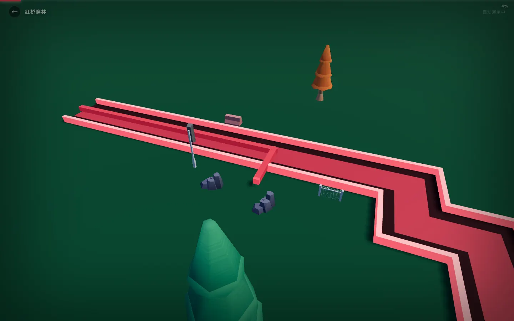

# 光明舞动线 · Dancing Line Guangming

一个基于 Three.js + Vite 的 3D 文旅节奏游戏原型。玩法灵感来自《跳舞的线》：玩家沿着节奏转弯穿越赛道，同时通过地标图片、场景色彩和音乐节奏展示光明区文旅路线。

## 在线试玩

- vnext: https://lamy72.vnxt.cc
- PinMe / IPFS: https://6993f908.pinme.dev

## 截图




## 功能亮点

- 3D 跳舞的线玩法：自动演示模式与游戏挑战模式
- 两个文旅关卡：红桥穿林、科学飞船
- 每 10% 进度展示一张地标图，使用 HTML overlay 避免被 3D 道具遮挡
- Three.js 赛道、边墙、进度门、路边 GLB 装饰物
- 音乐时间轴驱动的转弯、相机、HUD 和地标展示
- 移动端/桌面端统一 pointer 输入

## 技术栈

- Three.js
- TypeScript
- Vite
- Web Audio / HTMLAudioElement
- Playwright visual check

## 本地运行

```bash
npm install --include=dev
npm run dev
```

然后打开终端输出的本地地址，例如：

```text
http://127.0.0.1:5188/
```

## 构建

```bash
npm run build
```

构建产物会生成到：

```text
dist/
```

## 项目结构

```text
src/
  data/               关卡数据与时间轴
  entities/           线条实体
  game/               游戏主流程
  systems/            道路、地标、相机、音乐、HUD 等系统
public/
  assets/             封面、场景图、音乐
  landmarks/          地标展示图
  models/             路边装饰 GLB 模型
docs/screenshots/     README 截图
```

## 部署说明

当前项目已部署到 vnext 和 PinMe。由于原始静态资源较大，部署时使用了瘦身静态目录：只保留实际引用资源，并将大图压缩为 WebP。

更多部署记录见 [DEPLOY.md](DEPLOY.md)。
